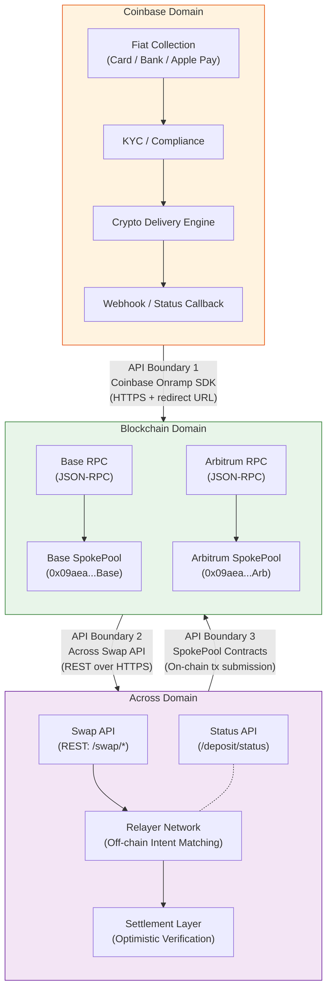
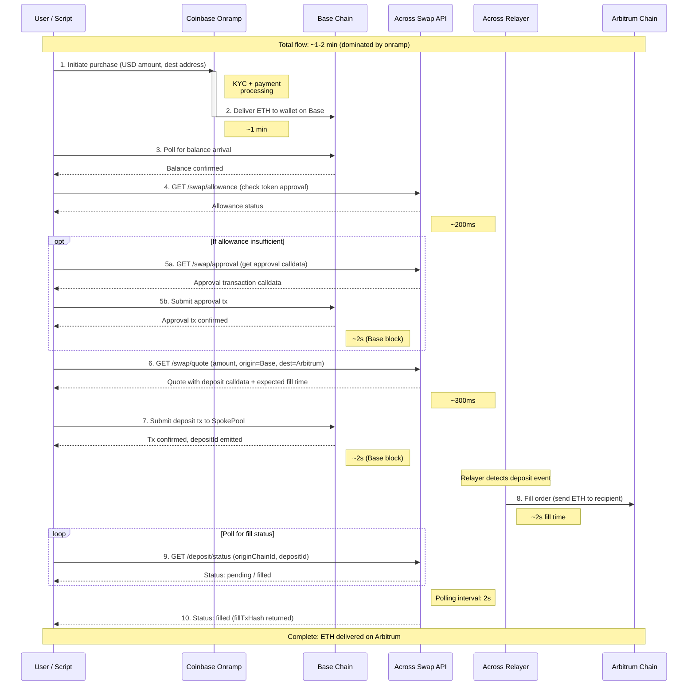
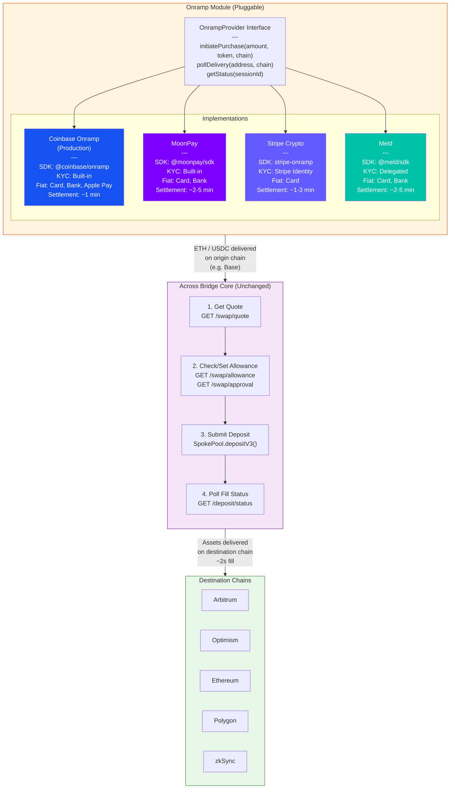
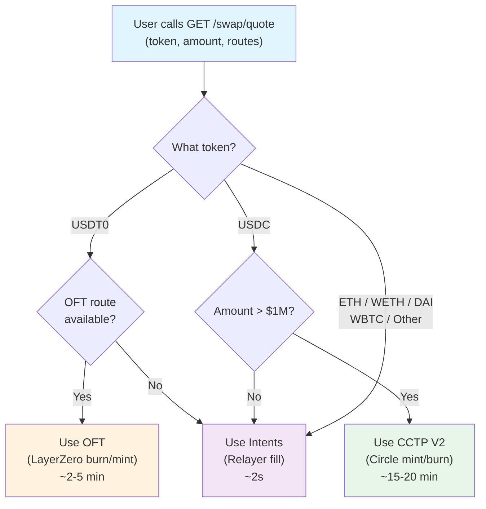
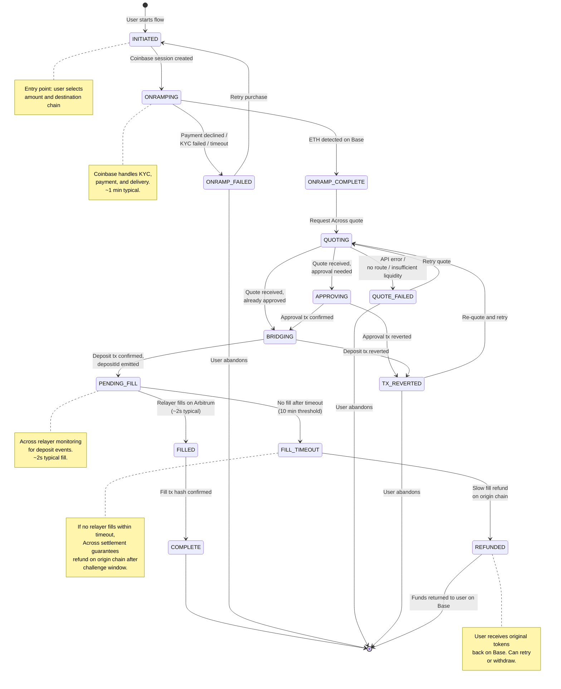

# Architecture Diagrams: Coinbase Onramp + Across Protocol

These diagrams document the architecture for composing Coinbase Onramp (fiat-to-crypto) with Across Protocol's crosschain bridge to achieve a seamless fiat-to-any-chain flow.

**Proven flow:** Fiat USD -> Coinbase Onramp (production) -> ETH on Base -> Across mainnet bridge (Intents, ~2s fill) -> ETH on Arbitrum

---

## 1. End-to-End Flow Diagram

Shows the full journey from fiat purchase through crosschain delivery.

```mermaid
flowchart LR
    subgraph User
        A["User (Browser / Script)"]
    end

    subgraph "Coinbase Domain"
        B["Coinbase Onramp\n(Fiat Collection + KYC)"]
        C["Crypto Delivery\n(ETH on Base)"]
    end

    subgraph "Base Chain"
        D["User Wallet\n(ETH Balance)"]
        E["Base SpokePool\n(Across Contract)"]
    end

    subgraph "Across Domain"
        F["Swap API\n(/swap/allowance\n /swap/approval\n /swap/quote)"]
        G["Relayer Network\n(Intent Matching)"]
    end

    subgraph "Arbitrum Chain"
        H["Arbitrum SpokePool\n(Across Contract)"]
        I["Destination Wallet\n(ETH on Arbitrum)"]
    end

    A -- "1. Initiate purchase\n(USD amount)" --> B
    B -- "2. Process payment\n~1 min" --> C
    C -- "3. Deliver ETH" --> D
    D -- "4. Get quote +\napproval tx" --> F
    F -- "5. Return calldata" --> D
    D -- "6. Submit deposit tx" --> E
    E -- "7. Emit V3FundsDeposited\nevent" --> G
    G -- "8. Fill order\n~2s" --> H
    H -- "9. Deliver ETH" --> I

    style A fill:#e1f5fe
    style B fill:#fff3e0
    style C fill:#fff3e0
    style D fill:#e8f5e9
    style E fill:#e8f5e9
    style F fill:#f3e5f5
    style G fill:#f3e5f5
    style H fill:#fce4ec
    style I fill:#fce4ec
```

---

## 2. System Boundary Diagram

Three integration domains with clear API boundaries between them.

---

## 3. Sequence Diagram with Timing

Full request/response flow with timing annotations on each interaction.

---

## 4. Generalization Diagram: Pluggable Onramp Interface

Demonstrates that the Across bridge logic is entirely independent of the onramp provider. Swapping Coinbase for another onramp changes only the left side of the architecture.

**Key insight:** The `OnrampProvider` interface abstracts fiat-to-crypto delivery. Any provider that can deliver tokens to a specified address on a supported origin chain can plug into this architecture. The Across bridge logic (quote, approve, deposit, poll) remains 100% identical regardless of onramp provider.

---

## 5. Settlement Mechanism Comparison

Across Protocol auto-selects the optimal settlement mechanism based on the token and route. The Swap API abstracts this entirely from the integrator.

### Comparison Table

| Dimension | Intents (Default) | CCTP V2 (Circle) | OFT (LayerZero) |
|---|---|---|---|
| **Mechanism** | Relayer fronts capital on destination, reimbursed later via optimistic verification | Native USDC mint/burn via Circle attestation | Burn token on source, mint on destination via LayerZero messaging |
| **Fill Speed** | ~2 seconds | ~15-20 minutes | ~2-5 minutes |
| **Token Support** | ETH, WETH, USDC, USDT, DAI, WBTC, and more | USDC only | USDT0 (OFT-wrapped USDT) |
| **Volume Sweet Spot** | < $1M per transfer (relayer capital constrained) | > $1M USDC (no capital constraint, native settlement) | Any size USDT0 (burn/mint, no capital needed) |
| **Capital Requirement** | Relayer must have capital on destination chain | None (mint/burn) | None (burn/mint) |
| **Finality Model** | Optimistic: assume valid, challenge window for disputes | Attestation: Circle signs off-chain, mint on destination | Messaging: LayerZero oracle + relayer confirm |
| **Who Bears Risk** | Relayer (fronts capital, reimbursed after verification) | Circle (attestation delay = security window) | LayerZero validators |
| **Auto-Selection** | Default for most tokens and routes | Auto-selected for large USDC transfers where speed is less critical | Auto-selected when bridging USDT0 between OFT-supported chains |

### Settlement Selection Flow

**Note:** The integrator never chooses a settlement mechanism. The Across Swap API auto-selects the optimal path based on token, amount, and route. This is fully abstracted from the caller -- you get the same API interface regardless of which mechanism is used under the hood.

---

## 6. State Machine Diagram

Complete state machine for the onramp-to-bridge flow, including all failure and recovery transitions.

### State Descriptions

| State | Description | Next (Happy Path) | Failure Transition |
|---|---|---|---|
| `INITIATED` | User has started the flow, parameters collected | `ONRAMPING` | -- |
| `ONRAMPING` | Coinbase Onramp session active, payment processing | `ONRAMP_COMPLETE` | `ONRAMP_FAILED` |
| `ONRAMP_COMPLETE` | ETH balance detected on Base wallet | `QUOTING` | -- |
| `QUOTING` | Fetching quote from Across Swap API | `APPROVING` or `BRIDGING` | `QUOTE_FAILED` |
| `APPROVING` | Submitting token approval transaction | `BRIDGING` | `TX_REVERTED` |
| `BRIDGING` | Submitting deposit transaction to SpokePool | `PENDING_FILL` | `TX_REVERTED` |
| `PENDING_FILL` | Deposit confirmed, waiting for relayer fill | `FILLED` | `FILL_TIMEOUT` |
| `FILLED` | Relayer has filled on destination chain | `COMPLETE` | -- |
| `COMPLETE` | Terminal success state | -- | -- |
| `ONRAMP_FAILED` | Coinbase payment/KYC failure | Retry -> `INITIATED` | Abandon |
| `QUOTE_FAILED` | Across API error or no available route | Retry -> `QUOTING` | Abandon |
| `TX_REVERTED` | On-chain transaction reverted | Retry -> `QUOTING` | Abandon |
| `FILL_TIMEOUT` | No relayer fill within timeout window | `REFUNDED` | -- |
| `REFUNDED` | Funds returned to user on origin chain | Terminal | -- |

---

## Rendering Notes

All diagrams use [Mermaid](https://mermaid.js.org/) syntax. They render natively in:
- GitHub markdown (README, issues, PRs)
- VS Code with the Mermaid extension
- Notion (with Mermaid embed block)
- Any Mermaid Live Editor: [https://mermaid.live](https://mermaid.live)

To preview locally, install the VS Code extension `bierner.markdown-mermaid`.
