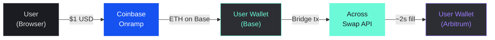
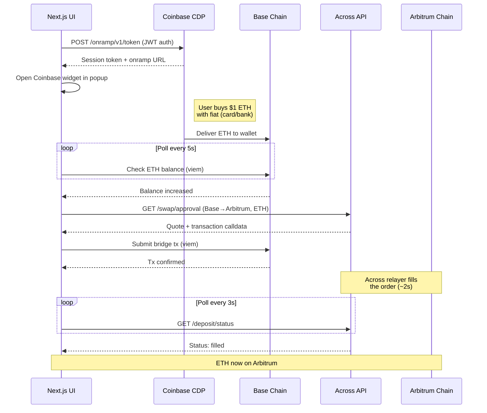
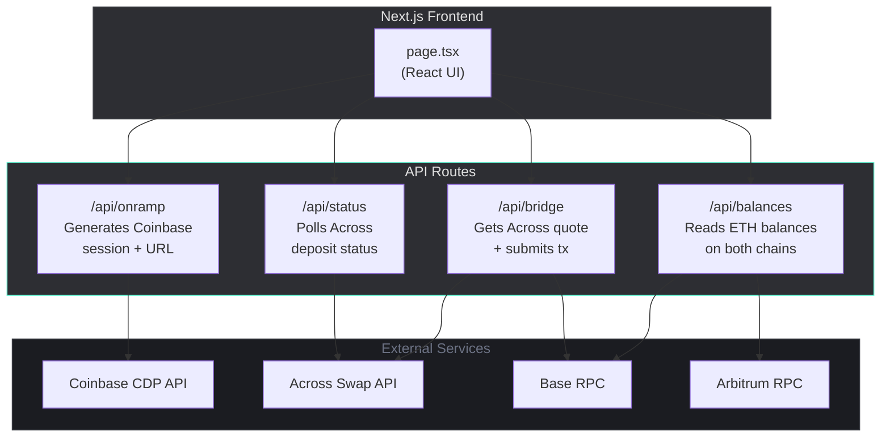

# Architecture: Coinbase Onramp + Across Bridge

A simple end-to-end flow: **Fiat USD → Coinbase Onramp → ETH on Base → Across Bridge → ETH on Arbitrum**

---

## 1. End-to-End Flow

---

## 2. Sequence Diagram

Shows the actual API calls made by the app.

---

## 3. App Architecture

---

## Rendering

All diagrams use [Mermaid](https://mermaid.js.org/) and render natively on GitHub, in VS Code (with Mermaid extension), or at [mermaid.live](https://mermaid.live).
